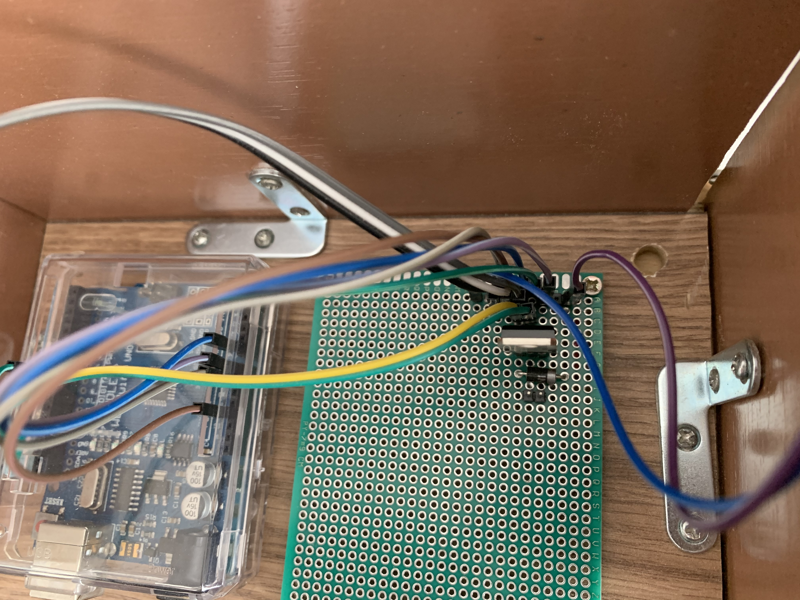

# SelenoidSoilWatering

 

I guess mainly i have followed these two tutorials. maybe another one i cannot find anymore.
https://www.instructables.com/Controling-a-solenoid-valve-with-an-Arduino/
and
https://chrisruppel.com/blog/arduino-soil-moisture-sensor/

My Components:
- Selenoid valve usually closed, similar to https://www.alibaba.com/product-detail/Plastic-solenoid-valve-for-water-dispenser_1699906875.html
- WDLuino UNO
- Led
- Diode
- Transistor
- Soil humidity sensor similar to https://www.sparkfun.com/products/13322, but from alibaba
- Solar panel system providing enough current to trigger the valve https://www.pni.ro/sistem-solar-fotovoltaic-pni-greenhouse-h01-30w-cu-acumulator-12v-7ah-usb-radio-mp3-2-becuri-led.html

 
 
 
